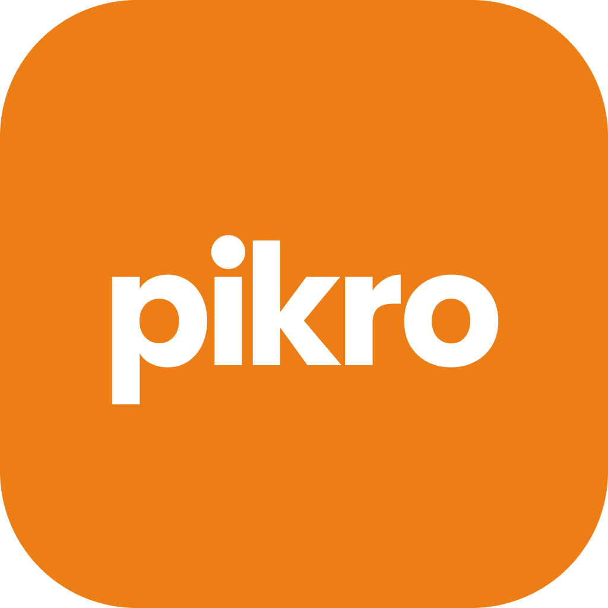
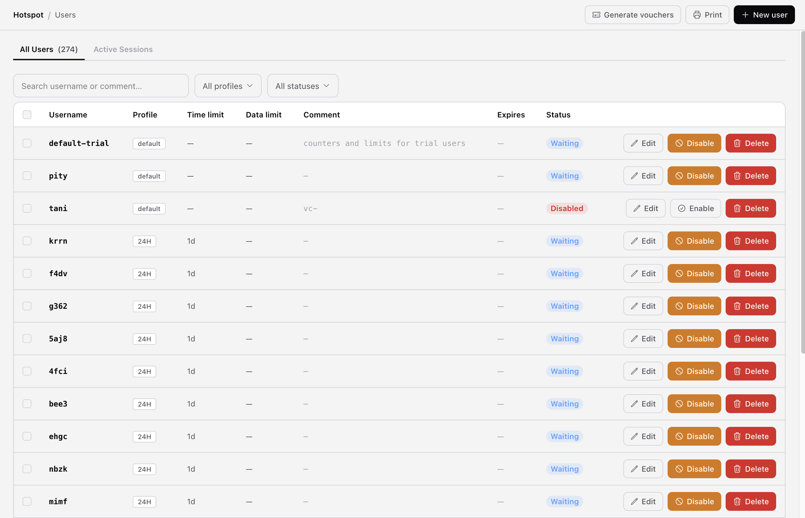
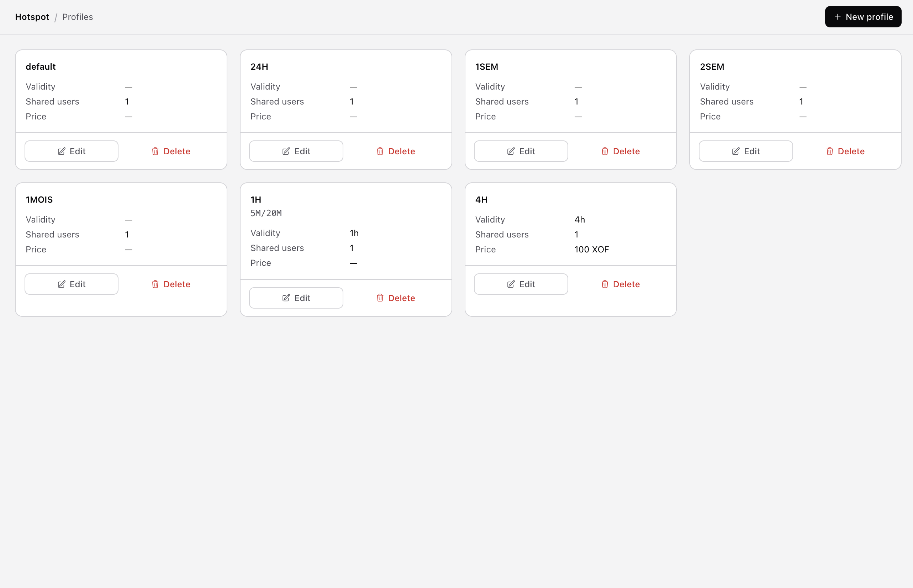
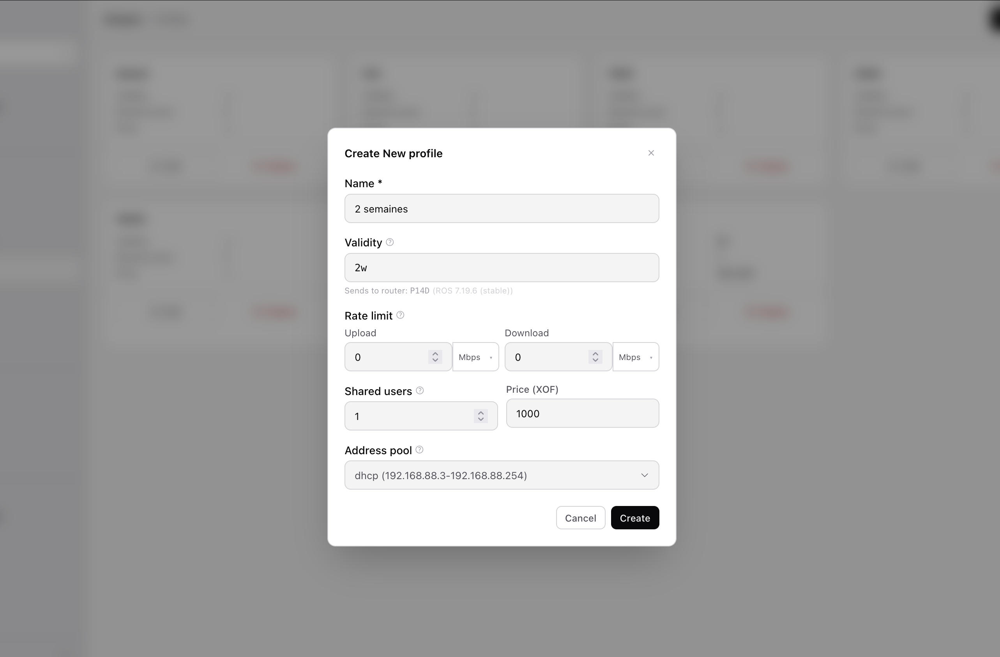
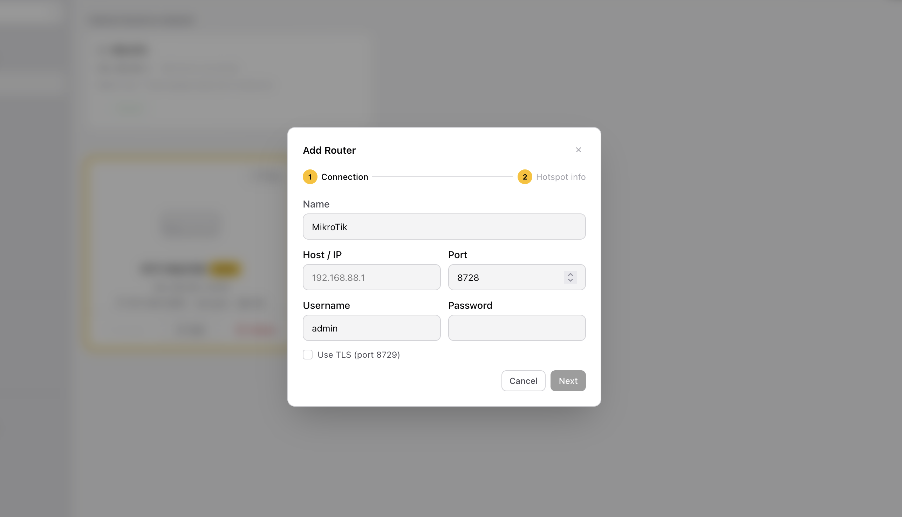
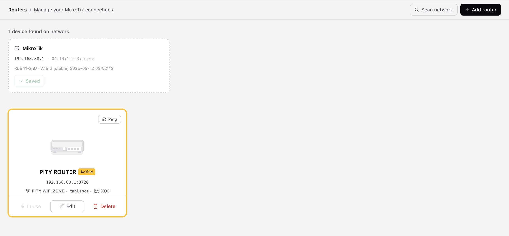
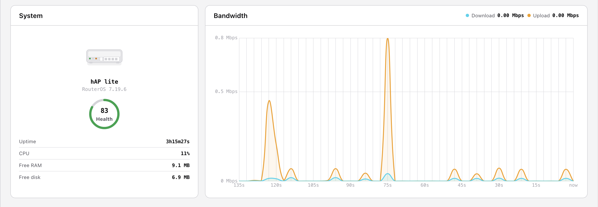
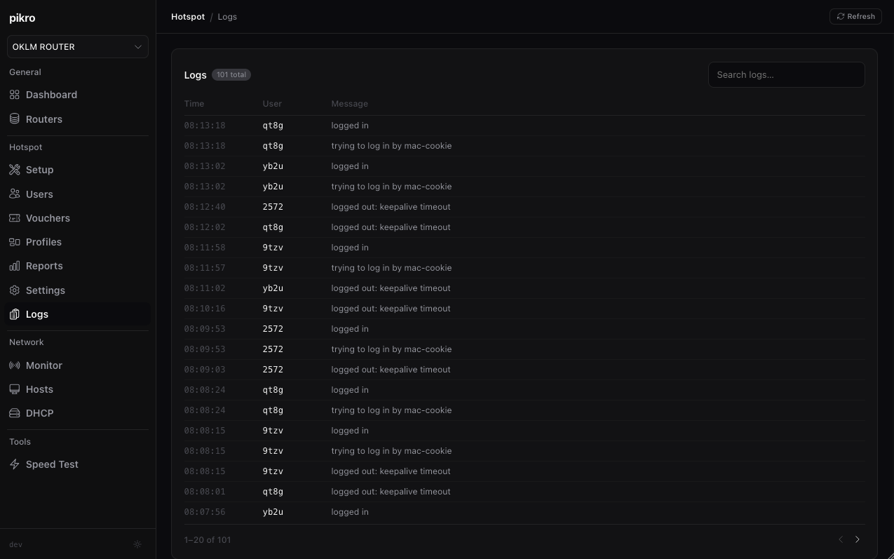

<p align="center">
  
</p>

<h1>Pikro</h1>
<p>A modern, open-source MikroTik hotspot manager</p>

<p>
  Manage MikroTik RouterOS hotspots and vouchers from one zero-install app.<br/>
</p>

---

## What it does

- **Hotspot voucher management** — generate, print, enable/disable, edit, and bulk-manage users and vouchers, no CLI required
- **Vouchers that actually expire** — installs a cleanup scheduler on the router, fixing the well-known RouterOS v7 expiry bug (Mikhmonv3)
- **Guided hotspot setup wizard** — provisions IP pool, DHCP, NAT, walled garden, DNS, login page, and cleanup in one flow (coming soon)
- **Customizable login pages** — pick from several ready-made hotspot login page designs, set a title/subtitle, preview live, and upload straight to the router
- **User & profile management** — create profiles with validity, price, bandwidth, and data-quota controls
- **Live monitoring** — active sessions, bandwidth, WAN IP, and system resources, with one-click disconnect for active sessions
- **Automatic router discovery** — finds MikroTik devices on your LAN via MNDP
- **Multi-platform** — single binary for Windows and macOS (Apple Silicon)
- **Local-first** — runs on your machine, no telemetry, credentials never leave your computer

> A free, open-source alternative to Mikhmon — built for ISPs, café/hotel operators, and community WiFi admins who sell or hand out WiFi vouchers and want a simple, reliable tool in markets where MikroTik is dominant.

If you love this project, please consider giving it a ⭐.

---

## Vouchers

Pick from 3 printable templates, each with a live preview before you print:

- **Classic** — dense ticket sheet, heavy borders, zero gap, ~60 vouchers per page
- **Modern** — compact professional cards, light spacing, ~60 per page
- **Business** — includes a scannable QR code that logs the user in directly, ~40 per page

The QR code is generated entirely client-side (no external service, no network
call — the old "generate it via Mikhmon's website" workaround isn't needed).
When the hotspot profile's auth mode supports it (http-pap), the code carries the
username and password pre-filled, so scanning it connects the user straight
away with no typing.

---

## Screenshots

<table>
  <tr>
    <td><br/><sub>User management</sub></td>
    <td><br/><sub>Hotspot profiles</sub></td>
  </tr>
  <tr>
    <td><br/><sub>Creating a profile</sub></td>
    <td><br/><sub>Auto-cleanup scheduler</sub></td>
  </tr>
  <tr>
    <td><br/><sub>Adding a router</sub></td>
    <td><br/><sub>Automatic router discovery</sub></td>
  </tr>
  <tr>
    <td><br/><sub>System health &amp; bandwidth</sub></td>
        <td><br/><sub>Hotspot logs</sub></td>

  </tr>
</table>

---

## Quick start

Download the build for your platform from [Releases](../../releases) and run it.
On macOS, open the `.dmg` and drag Pikro into Applications; on Windows, run the `.exe` directly.

Pikro runs as a tray application. Starting it places an icon in the menu bar
(macOS) or system tray (Windows). Click **Open Pikro** to open the app in
your browser, or **Quit** to stop the server.

A firewall prompt may appear on first run — click **Allow** so Pikro can reach
your router over the local network.

```bash
./pikro
# Pikro running at http://localhost:8080
```

> **Note:** Release binaries aren't code-signed yet (see
> [Releases](../../releases) — each build carries a
> [SLSA](https://slsa.dev) provenance attestation proving it was built from
> this repo, but isn't Apple/Microsoft-signed). On first run:
>
> - **macOS:** Gatekeeper will say **"Pikro is damaged and can't be opened"**
>   — this is a false positive triggered by macOS quarantining unsigned apps
>   downloaded via a browser, not actual corruption. Clear the quarantine flag:
>   ```bash
>   xattr -cr /path/to/Pikro.app
>   ```
>   Then open it normally. (Right-click → Open does *not* work around this
>   particular message on recent macOS — it only bypasses the milder
>   "unidentified developer" dialog, which this isn't.)
> - **Windows:** if SmartScreen appears, click **More info** → **Run anyway**.

---

## Docs

- [Building from source](docs/building.md)
